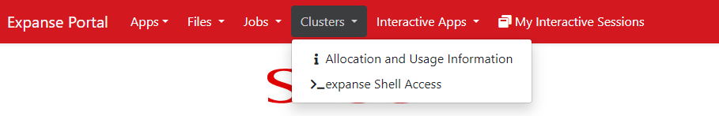

# Enlace_Training_2024_summer

Welcome to Enlace Project! Enjoy with the following tasks.

## Task 1: Log into SDSC and look around
### S1. system access
The best way to get access to SDSC is through the user portal https://portal.expanse.sdsc.edu/.
Log into Expanse with your ACCESS ID and password.


### S2. Start a terminal
You can start a terminal to the login node through menue `Clustres` --> `_expanse Shell Access`.



### S3. Try these Linux shell commands
#### c1. which directory you are at
```
pwd
```
#### c2. change to the project/scratch directory
```
cd /expanse/lustre/projects/csd877/YOUR_URSERNAME
```
```
cd /expanse/lustre/scratch/YOUR_URSERNAME/temp_project
```
### c3. list all files under the directory

```
ls
```

### c4. create a file with vi editor
```
vi example.txt
```
Then you open a file named example.txt. You can add contents into it after pressing `i`, which means insert. After you finish printig characters, press `Esc` to stop writing. Then you can save it by press `:w` followed by `Enter`， which means write. If you want to cancel your updates in the file, press `u`. Finally you can save it by pressing `:wq` (which means quit) followed by `Enter`. Or if you do not want to save the updates in the file, press `:q!` (which mean forcely quit) followed by `Enter`.

Please play around with vi editors to get familiar with it.

### c5. create a directory
```
mkdir dir0
```
Then
```
ls
```
, you can see your directory

### c6. remove file/directory
To remove a file, you use `rm filename`
```
rm example.txt
```
to remove a directory, you use `rm -r directory`
```
rm -r dir0
```
Be careful, there is no `recycle bin` like windows. As long as you remove files/directory, you can not get it back.

Except these commands, please try your best to explore other linux command. For example,
https://web.njit.edu/~alexg/courses/cs332/OLD/F2020/hand3f20/Linux-Tutorial.pdf

https://www.youtube.com/watch?v=-DHCm9AlXvo


