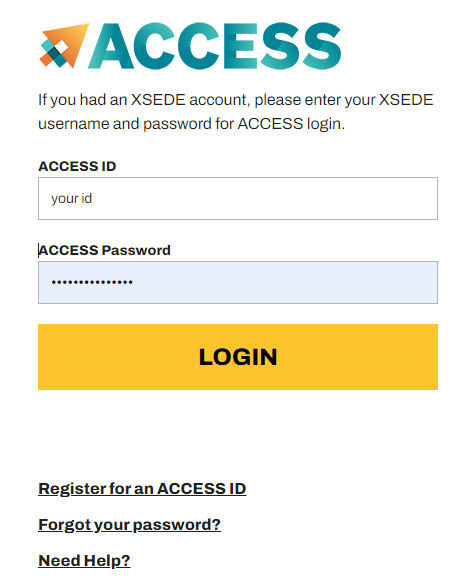

# Enlace_Training_2024_summer

Welcome to Enlace Project! Enjoy with the following tasks.

## Task 1: Log into SDSC and look around
### S1. system access
The best way to get access to SDSC is through the user portal https://portal.expanse.sdsc.edu/.
Log into Expanse with your ACCESS ID and password.

### S2. Start a terminal
You can start a terminal to the login node through menue `Clustres` --> `_expanse Shell Access`
